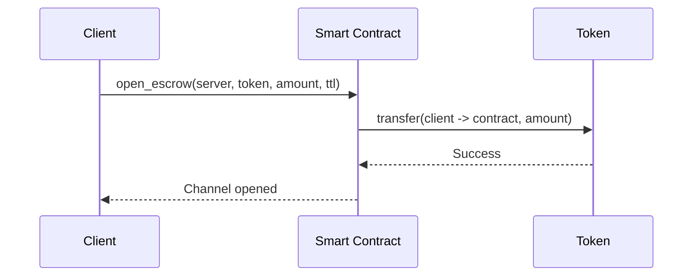
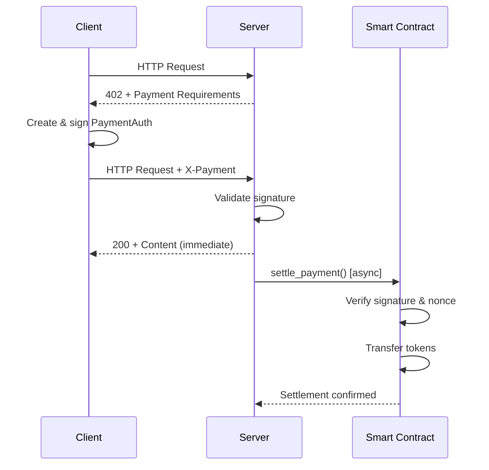
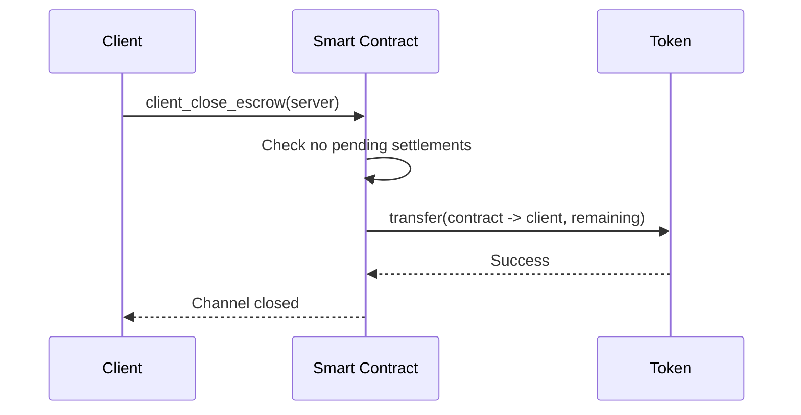

# x402-Flash Architecture

## Overview

x402-Flash is a micropayment system built on Stellar Soroban that enables instant, low-cost payments for digital services. The system uses payment channels to minimize on-chain transactions while maintaining security.

## Core Components

### 1. Smart Contract (Soroban)

**Location**: `contracts/x402-flash-settlement/`

The settlement contract manages payment channels between clients and servers.

#### Key Functions

- `open_escrow()` - Client deposits funds into a payment channel
- `settle_payment()` - Server settles a signed payment from the channel
- `client_close_escrow()` - Client closes channel and withdraws remaining funds
- `current_escrow()` - View current channel balance

#### Data Structures

- **Channel**: Stores escrow balance, state, TTL, and metadata
- **PaymentAuth**: Structured payment authorization (EIP-712 style)
- **Settlement**: Historical settlement records

#### Security Features

- ED25519 signature verification
- Nonce-based replay protection
- Deadline enforcement
- Rate limiting
- Emergency withdrawal (when paused)

### 2. TypeScript SDK

**Location**: `sdk/typescript/`

#### Client SDK (`X402FlashClient`)

Manages client-side operations:
- Opening payment channels
- Creating signed payment authorizations
- Automatic 402 payment handling via `wrapFetch()`
- Channel management

**Flow**:
1. Client makes HTTP request
2. Server responds with 402 + payment requirements
3. `wrapFetch()` automatically creates payment auth
4. Request is retried with X-Payment header
5. Server responds immediately

#### Server SDK (`X402FlashServer`)

Express middleware for servers:
- Returns 402 with payment requirements
- Validates X-Payment headers
- Responds immediately (Flash!)
- Settles payments asynchronously on-chain

**Flow**: 1. Middleware checks for X-Payment header
2. If missing, return 402 with requirements
3. If present, validate and settle async
4. Immediately call `next()` to serve content

### 3. Payment Protocol

#### HTTP 402 Payment Required

Standard HTTP status code for payment required.

**Response Format**:
```json
{
  "x402Version": 1,
  "accepts": [{
    "scheme": "flash",
    "network": "stellar-testnet",
    "maxAmountRequired": "100000",
    "resource": "/api/endpoint",
    "payTo": "GSERVER...",
    "asset": "GTOKEN...",
    "maxTimeoutSeconds": 60
  }],
  "error": "X-Payment header required"
}
```

#### X-Payment Header

**Format**: Base64-encoded JSON

```json
{
  "x402Version": 1,
  "scheme": "flash",
  "network": "stellar-testnet",
  "payload": {
    "auth": {
      "settlementContract": "CCONTRACT...",
      "client": "GCLIENT...",
      "server": "GSERVER...",
      "token": "GTOKEN...",
      "amount": "100000",
      "nonce": 1234567890,
      "deadline": 1700000000
    },
    "signature": "hex-encoded-ed25519-signature",
    "publicKey": "GCLIENT..."
  }
}
```

## Payment Flow

### Channel Opening



### Payment Settlement



### Channel Closing



## Security Model

### Signature Verification

- Client signs PaymentAuth with ED25519 private key
- Server submits signature + public key to contract
- Contract verifies signature matches client's public key
- Ensures only client can authorize payments

### Replay Protection

- Each payment includes a nonce
- Contract tracks used nonces per (client, server) pair
- Prevents same payment from being settled twice

### Deadline Enforcement

- Each payment includes a deadline timestamp
- Contract rejects expired payments
- Protects against delayed settlement attacks

### Rate Limiting

- Contract enforces minimum time between settlements
- Prevents DoS attacks via rapid settlement requests

### TTL Protection

- Channels have a time-to-live (TTL)
- Automatically close if inactive too long
- Prevents funds from being locked indefinitely

## Gas Optimization

### Persistent vs Instance Storage

- **Persistent**: Channel data, nonces, settlements (long-term)
- **Instance**: Admin, pause state (contract-level)- **TTL Extension**: 100,000 ledgers (~5.5 days) for active data

### Settlement History Pruning

- Keep only last 100 settlements per channel
- Removes oldest when limit exceeded
- Balances history tracking with storage costs

## Scalability

### Off-Chain Payments

- Only channel open/close goes on-chain during normal use
- Multiple payments settled via single on-chain transaction
- Dramatically reduces transaction costs

### Async Settlement

- Server responds immediately to client
- Settlement happens in background
- Client doesn't wait for blockchain confirmation

### Batching Potential

- Multiple payments can be batched into single transaction
- Further reduces gas costs for high-volume servers

## Extension Points (Phase 2+)

### Agent Registry

On-chain registry for AI agents with:
- Capability discovery
- Pricing information
- Reputation scores

### Token Support

- Currently works with any Stellar token
- Can add multi-token channels
- Cross-token swaps during settlement

### Subscription Models

- Time-based channels (monthly/daily passes)
- Prepaid credit pools
- Volume discounts

---

## Comparison with Alternatives

| Feature | x402-Flash | Lightning (BTC) | State Channels (ETH) |
|---------|-----------|-----------------|---------------------|
| Settlement Speed | Instant | Instant | Instant |
| On-chain Cost | Very Low | Low | High |
| Setup Complexity | Simple | Complex | Complex |
| Bi-directional | No | Yes | Yes |
| Use Case | Pay-per-use APIs | General payments | General state |

x402-Flash is optimized for **unidirectional micropayments** in **client-server** scenarios, making it ideal for API monetization and AI agent payments.
